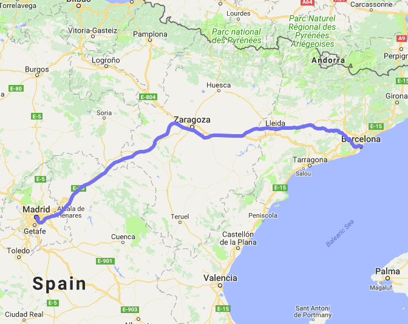

# AStar assignment - A routing problem

## Introduction
This is an assignment from the Optimisation subject at Master's in modelling for Science and Engineering in the UAB.
Professor Lluís Alsedà (http://mat.uab.cat/~alseda/MasterOpt/index.html).

The assignment consists in computing an optimal path (according to distance) from *Basílica de Santa
Maria del Mar* (Plaça de Santa Maria) in Barcelona to the *Giralda* (Calle Mateos Gago) in Sevilla by
using the `AStar` algorithm. To this end one has to implement the `AStar` algorithm (compulsory in form
of a function - not inside the main code) and compute and write the optimal path.

As the reference starting node for *Basílica de Santa Maria del Mar* (Plaça de Santa Maria) in
Barcelona we will take the node with key `(@id): 240949599` while the goal node close to *Giralda* (Calle
Mateos Gago) in Sevilla will be the node with key `(@id): 195977239`.

## Authors
* **Martí Municoy**, mail@martimunicoy.com
* **Dani Salgado**, daniel.salgado@e-campus.uab.cat

## Description

We introduce a program which makes use of the A* algorithm to solve general routing problems.
We have added the possibility of choosing the locations by entering the latitude and longitude coordinates of the starting and goal locations.
Then, the program finds the nearest existing nodes to these pairs of coordinates and computes the optimal path between them, if there exists any.
Our A* implementation in C language has been proved to be a reliable tool to solve a general routing problem to find paths that minimize distance.
We assume that the data sets for the regions of interest are available and are formatted in a proper way.
In addition, we have added a script in Python that is able to represent the paths graphically as it is done by Google Maps.


A detailed explanation of the installation and the execution of the program is found below.

## Getting started
These instructions will get you a copy of the project up and running on your local machine for development and testing purposes.

### Prerequisites
Depending on the native OS some external libraries will need to be included to run this program. See install section below.

This project supports the following C compiler versions:
* Apple gcc v4.2.1
* Ubuntu (16.4) gcc v5.4.0

Other regular C compilers should work as well but have not been tested yet.

For a graphical representation of the paths via Google Maps, Python 2.7 needs to be installed and the following (additional) packages are required:
   * _matplotlib_
   * _requests_

### Installing with Make

Setting a running copy of this project with `Make` is straightforward.
Make can build the project executables according to the user preferences.
From the main directory of the project you can run several `Make`commands with different predefined built in behaviors.
They are summarized below:

   * Type `make` to install all executables
   * Type `make install` to install only the main executables of the program
   * Type `make test` to only install the testing executable of the program
   * Type `make clean` to remove all executables

In principle, testing executables do not offer useful or reliable data.
They do not offer a good user experience and their use is recommended only for development purposes.

Besides the installation with `Make`, this program includes a Python script which can represent graphically yhe paths on a Google Maps map.
To run this script a proper Python environment needs to be configured.
There are different ways to get this Python script working. We recommend you two different methods depending on your system architecture.

### Getting Python libraries on OSX

The easiest way to set the required packages up is by installing [Conda](https://conda.io/docs/).
Download the suitable binary file from their oficial [website](https://conda.io/docs/user-guide/install/macos.html) and follow the instructions from there.

With a working `Python 2.7` Conda environment set up, you can run the following commands to install the required packages from above:

```
conda install matplotlib
```

```
conda install requests
```

### Installing on Linux

Additionally, you can get a proper Python environment by using the [Python Package Index](https://pip.pypa.io/en/stable/) tool (`pip`).
It can be installed in a Debian/Ubuntu based system by using the following command:
```
sudo apt install python-pip
```

Then, we just need to ask pip to install the required Python packages:

```
pip install matplotlib
```

```
pip install requests
```


## Instructions
The default `Make` installation is the following one:
```
make install
```
It will compile 4 executables which are listed and briefly explained below:

   * **bincreator.exe**: it parses a suitable input map file (_.map_) and saves the corresponding graph to a binary file (_.bin_).
   * **cmapcreator.exe**: it parses a suitable input map file (_.map_) and saves the corresponding graph to a compressed binary file (_.cmap_).
   * **routing.exe**: it takes the graph previously parsed by either **bincreator.exe** (_.bin_) or **cmapcreator.exe** (_.cmap_) and uses it to find the shortest route between the two input points.
   * **routeprinter.exe**: it plots the route obtained by **routing.exe** (_.out_) on a map from Google Maps (it requires a proper Python 2.7 environment).

### bincreator.exe
This program reads a suitable input map file (_.map_) and, from its information, it creates a graph.
The resulting graph is saved in a binary file (_.bin_).
To read the map properly, _bincreator.exe_ needs that the input map file satisfies the format rules defined below, in the corresponding section.
It is executed in the following way:

```
bincreator.exe [file] [...]
```

It requires a mandatory argument `[file]` which is the directory to the input map file.
Additionally, it accepts the following optional arguments:

   * `[-o directory]` which is the path to the directory where the resulting binary file is going to be saved.
   * `[-f]` which makes the program to create the graph faster. To achieve this it does not minimize graph inconsistencies and the performance when working with the resulting graph will be lower.
   * `[-h]` which prints out a brief description of all these arguments.

### cmapcreator.exe
This program reads a suitable input map file (_.map_) and, from its information, it creates a graph.
The resulting graph is saved in a compressed binary file (_.cmap_).
It is much slower than _bincreator.exe_ but the output binary file is much smaller.
To read the map properly, _cmapcreator.exe_ needs that the input map file satisfies the format rules defined below, in the corresponding section.

It is executed in the following way:

```
cmapcreator.exe [file] [...]
```

It requires a mandatory argument `[file]` which is the directory to the input map file.

Additionally, it accepts the following optional arguments:

   * `[-o directory]` which is the path to the directory where the resulting compressed binary file is going to be saved.
   * `[-f]` which makes the program to create the graph faster. To achieve this it does not minimize graph inconsistencies and the performance when working with the resulting graph will be lower.
   * `[-h]` which prints out a brief description of all these arguments.

### routing.exe
This program is the one that performs the AStar Algorithm itself.
It reads a graph from a suitable binary file, either compressed or not (_.bin_ or _.cmap_), and uses its information to find the shortest route between two of its nodes.
The starting and ending nodes need to be specified as command-line arguments.
It is also able to perform the AStar Algorithm by calculating distances between nodes with different approaches.

The program is executed in the following way:

```
routing.exe [file] [-s id/lat,lon] [-e id/lat,lon] [...]
```

It requires a mandatory argument `[file]` which is the directory to the input binary file which can be a regular _.bin_ file or a compressed _.cmap_ file.
Take into account that if a compressed _.cmap_ file is used the execution of the program will take more much time.
Two more arguments must be included when executing the program:
   * [-s id/lat,lon] which sets the starting node.
   * [-e id/lat,lon] which sets the ending node.
Both nodes can be defined in two different ways.
First, they can be defined by their id from the graph if a single number is given.
They can also be defined by entering the latitude and longitude coordinates of a place.
In this case, the program will search in the graph for the node which is closest to this location.
Notice that these two values must be written without any white space between them and using only a comma (,) to separate them.

Additionally, _routing.exe_ accepts the following optional arguments:

   * `[-o directory]` which is the path to the directory where the route information is going to be saved.
   * `[-d number]` which is the selection of the method used to calculate the heuristic distance by the AStar Algorithm.
   * `[-w number]` which is the selection of the method used to calculate the weight between the edges of the graph.
   * `[-h]` which prints out a brief description of all these arguments.

## Format rules of compatible map input files
The two programs that read map files to construct a graph are _bincreator.exe_ and _cmapcreator.exe_.
They need to work with compatible map input files which have to contain information about the nodes and the ways of the graphs according to some rules.
Nodes are the points which are used to contruct the paths of the map and the ways contain information about the connectivity between nodes.
Those map input files which do not fulfill these rules will not be compatible with these programs.
They are the following:
   1. Each line of the file contains information about a node or a way.
   2. Node lines must start with the word `node`.
   3. Way lines must start with the word `way`.
   4. Node lines must have the following format: `node|@id|@name|@place|@highway|@route|@ref|@oneway|@maxspeed|node_lat|node_lon`
   5. The only mandatory parameters are: `@id`, `node_lat` and `node_lon`.
   6. The program is also able to parse the name of the node if a `@name` is given,
   7. Way lines must have the following format: `way|@id|@name|@place|@highway|@route|@ref|@oneway|@maxspeed|member nodes|...`
   8. The only mandatory parameter is `member nodes` which is a list of all the nodes that are sequantially connected.
   9. If `@oneway` parameter is given, the link between connected nodes will be in a single direction according to the original submitted order.

## Distance functions available
The _routing.exe_ program is able to calculate distances between nodes with different approaches.
The user can choose one of the following methods through either command-line arguments or while running the program.
Below there is a summary of all the methods that are available:
   1. Haversine
   2. Spherical law of cosines
   3. Equirectangular approximation
   4. Haversine with variable Earth radius
   5. Spherical law of cosines with variable Earth radius
   6. Equirectangular approximation with variable Earth radius
   7. Zero distance (equal to 0.0)
   8. Uniform distance (equal to 1.0)

## Test running
A simple test can be run by performing the following steps.

First of all, we need to download a proper map input file.
You can get a map from Spain [here](http://mat.uab.cat/~alseda/MasterOpt/spain.csv.zip).

Save it into a known folder.
It is recommended to save it into a folder inside the repository (it is not mandatory but the access to the file will be faster).
For instance, a good choice is:
```
path_to_the_repository/AStar-Algorithm/routing/inputs/spain.csv
```

Then, you can execute _bincreator.exe_ to read the input map file, create the graph and save it into a binary file.
```
bincreator.exe inputs/spain.csv
```
Unless it is specified through a command-line argument, the output binary file (_.bin_) will be saved into `bin/` folder.

Afterwards, you can execute _routing.exe_ to calculate the shortest route between two nodes from this map.
These two nodes correspond to the *Basílica de Santa Maria del Mar* (Plaça de Santa Maria) in Barcelona, `(@id) 240949599`, and to the *Giralda* (Calle Mateos Gago) in Sevilla, `(@id) 195977239`.
```
routing.exe bin/map.bin -s 240949599 -e 195977239
```
Unless it is specified through a command-line argument, the output route file will be saved as `routes/path.out`.

Finally, we can represent graphically the route on a map from Google Maps by using the last script.
```
routeprinter.exe -f routes/path.out
```
A plot of the resulting route should be displayed in your default web browser (to see the map an Internet connection is necessary).



## References

   * [1] A\*-Algorithm GitHub repository, Martí Municoy and Daniel Salgado, https://github.com/dsalgador/AStar-Algorithm

   * [2] A\* search algorithm. (2018, January 28). In Wikipedia, The Free Encyclopedia. Retrieved 18:34, February 7, 2018, from https://en.wikipedia.org/w/index.php?title=A*_search_algorithm\&oldid=822855961

   * [3] Admissible heuristic. (2017, December 7). In Wikipedia, The Free Encyclopedia. Retrieved 19:25, February 7, 2018, from https://en.wikipedia.org/w/index.php?title=Admissible_heuristic\&oldid=814117910

   * [4] Heuristics: Intelligent Search Strategies for Computer Problem Solving, Judea Pearl. Addison-Wesley Pub (Sd), ISBN: 0201055945, 1984-04

   * [5] Calculate distance, bearing and more between Latitude/Longitude points, Chris Veness. http://www.movable-type.co.uk/scripts/latlong.html

   * [6] Haversine formula. (2017, December 31). In Wikipedia, The Free Encyclopedia. Retrieved 00:31, February 8, 2018, from https://en.wikipedia.org/w/index.php?title=Haversine_formula\&oldid=817871096

   * [7] Earth radius. (2018, January 22). In Wikipedia, The Free Encyclopedia. Retrieved 15:45, February 7, 2018, from https://en.wikipedia.org/w/index.php?title=Earth_radius\&oldid=821830040

   * [8] P. E. Hart, N. J. Nilsson and B. Raphael, A Formal Basis for the Heuristic Determination of Minimum Cost Paths, in IEEE Transactions on Systems Science and Cybernetics, vol. 4, no. 2, pp. 100-107, July 1968. doi: 10.1109/TSSC.1968.300136. http://ieeexplore.ieee.org/stamp/stamp.jsp?tp=\&arnumber=4082128\&isnumber=4082123

   * [9] Latitude, longitude and address of any point on Google Maps, https://www.gps-coordinates.net

## License
This project is licensed under the GNU License - see the [LICENSE](LICENSE) file for details

